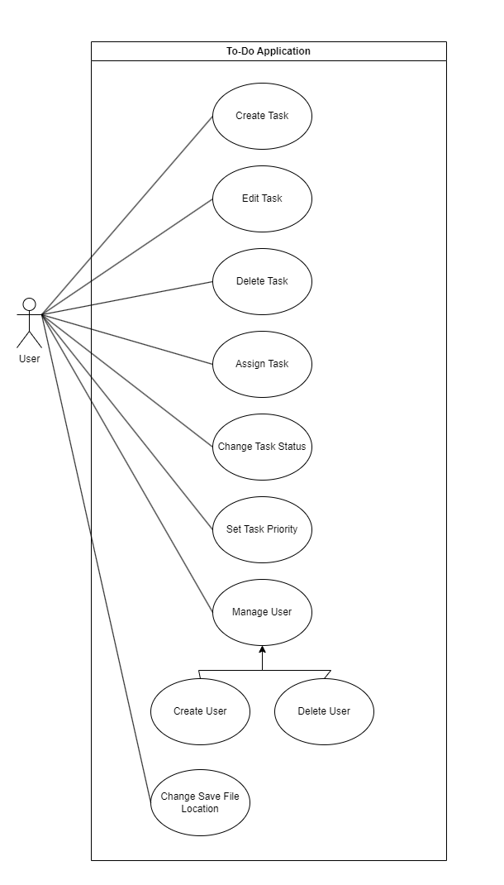
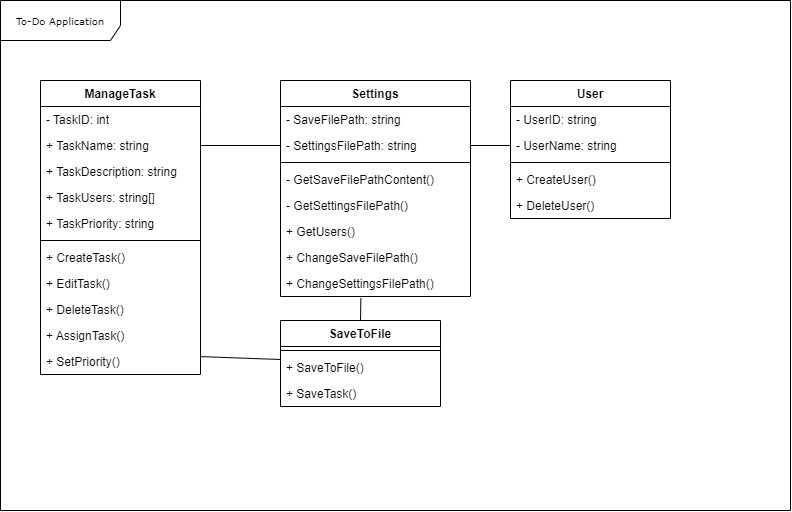

# ToDoApplication
A simple application where users can manage To-Do lists

## Table of content
- [Introduction](#introduction)
- [User Guide](#user-guide)
- [Developer Guide](#developer-guide)
- [UML Use Case Diagram](#uml-use-case-diagram)
- [UML Class Diagram](#uml-class-diagram)
- [Versioning](#versioning)
- [Data Storage](#data-storage)


## Introduction
This To-Do Application is an application programmed with C# which should make the managing of tasks much easier. With this program you will be able to create, edit and delete tasks.
But that is not the only thing that will be possible with this program. <br><br>
To see an overview of all the functions, you should check out [the Use Case Diagram](#uml-use-case-diagram) or the [User Guide](#user-guide).


## User Guide 

## Developer Guide 

## UML Use Case Diagram
UML (Unified Modeling Language) is a way how to communicate a basic idea for a Program. Here I will show you the Use Case diagram for this project. <br> <br>
Down below, you can see the Use Case Diagram.



Here we can see multiple Use Cases. Most of them should be self-explanatory. <br><br>
We have Use Cases for the tasks itself. Use Cases like ``Create Task``, ``Edit Task`` or ``Delete Task``. <br>
Also, we can assign the different tasks to one or multiple people, and we can change the status of the task. <br>
The Users should be created first. For that case, we have the ``Manage`` User Use Case.

## UML Class Diagram
To write code that makes sense, I made a Class Diagram. This diagram should help me make classes that make sense and are easy to maintain. <br>
Down below, you can see the class diagram.



## Versioning
This project will be following the [Semantic Versioning](https://semver.org/) structure. In this structure the version number is split into Major, Minor and Patch.

### How to change the version
To change the version of this project, all you need to do is following:
- Open the Project in Visual Studio 
- Make a right click under properties
- Choose the Assembly Information option
- Change the version
- Save the changes

## Data Storage
Data Storage is very important. In this application, data will be stored locally and in a .csv file. <br>
This file will be located at the Documents' directory in a directory named ```ToDo Application``` of the user itself. <br>
Here is an example of a possible path: ```C:\Users\daniel\Documents\ToDo Application```

## Ideas for future updates
This will be a list of the possible future improvements I can make to the application:

#### Create Profiles
The User should be able to create as many profiles as he wants. This would create a different CSV file and would save all tasks separately. This would allow the user to make a profile for work and one for private tasks. 